## Solution Design

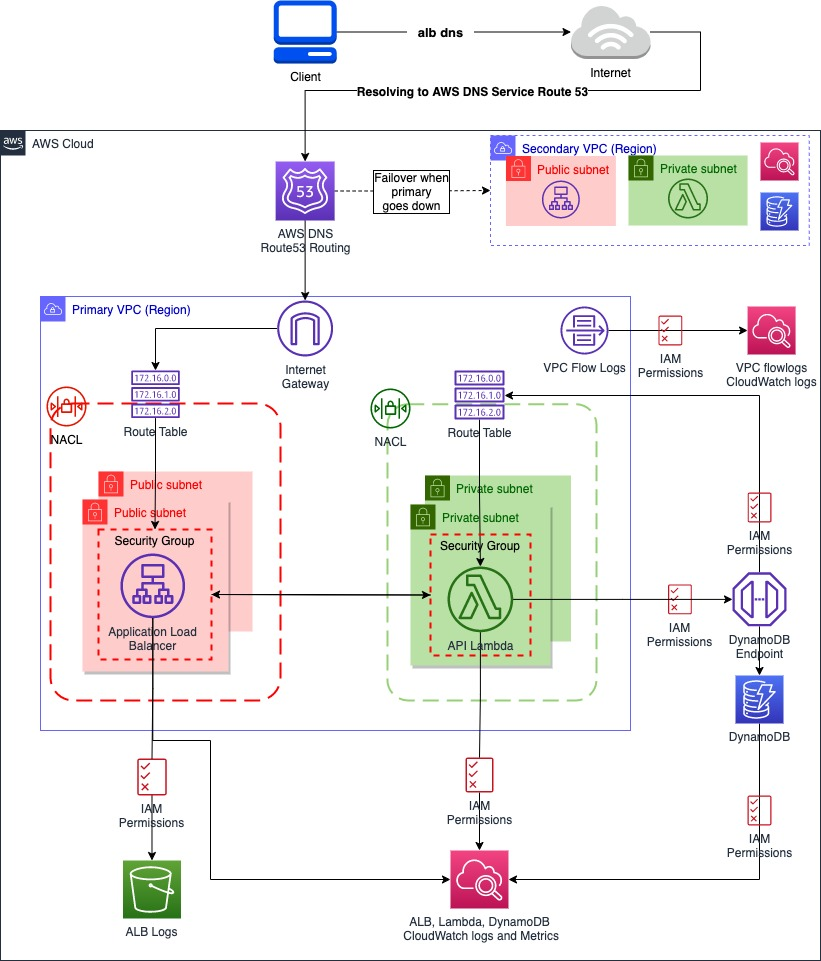

## Directory Structure and Important files to be aware of

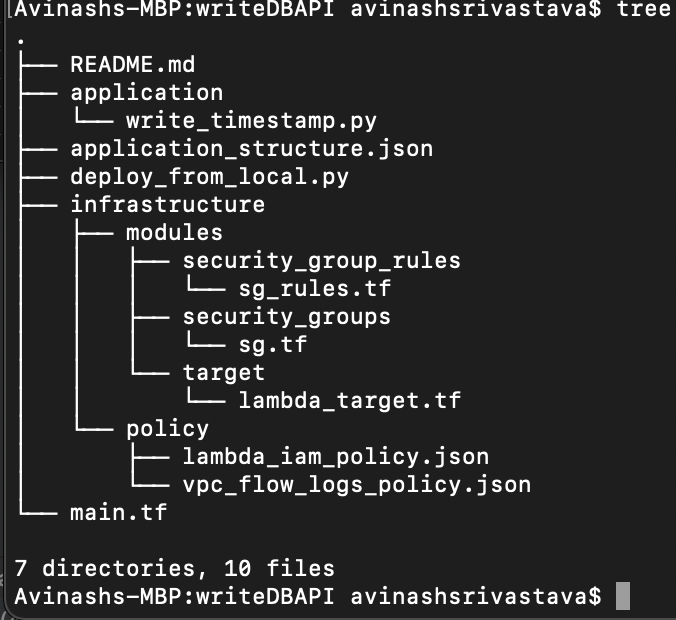

    *   Deployer file -->  deploy_from_local.py
    *   Business logic/API layer/Application -> ./application/write_timestamp.py
    *   An attempt to design the application structure so that deployment can be cotrolled via config file --> application_structure.json
    *   Infrastructure builder --> main.tf
        *   Create security group rules 
                --> ./infrastructure/modules/security_group_rules/sg_rules.tf
        *   Create Security groups 
                --> ./infrastructure/modules/security_groups/sg.tf
        *   Configure the infrastructure of API layer e.g. Lambda and target groups etc 
                --> ./infrastructure/modules/target/lambda_target.tf

## Execution
infrastructure
#### Prerequisite:
    * Terraform version v0.13 or above must be installed. This project is build/tested using v0.14.2/0.15.4
    * Python version 3 (3.5 above) should be installed, This project is build/tested using Python 3.8.2
        * python3 -m pip install boto3 (pip Install boto3)
        * python3 -m pip install requests (pip Install requests)
        Avoiding file clutter else a requirements.txt will also be okay to define the required python packages.
        
    https://boto3.amazonaws.com/v1/documentation/api/1.9.42/guide/quickstart.html)

#### AWS Configure
    * Create an Admin account on AWS which has access to provision the resources like ALB, Lambda, DynamoDB, CloudWatch, IAM etc
    * Install AWS CLI on your machine, Make sure you are able to connect to AWS post configuring AWS with "aws configure"
    * Default region used is eu-west-1
    * Worth checking: Login to AWS console --> go to VPC --> Managed prefix lists, It should existing for s3 and dynamoDB or for either of them. If not don't worry terraform wil created.

### Clone Project repository writeDBAPI
    * git clone https://github.com/asrivastava-github/writeDBAPI.git

### Deployment: plan --> apply --> visual test --> planDestroy --> destroy
    * cd writeDBAPI

        Currently I am owning avi-assignment-api-service bucket so if you are testing/deploying the solution, and getting
        bucket exists error, let me know I will delete, Alternatively change the bucket name in application_structure.json as s3 
        bucket names are unique.

    * Run below to plan the system infrastructure
        * python3 deploy_from_local.py -a plan -e poc

    * Run below to provision the system infrastructure
        * python3 deploy_from_local.py -a apply -e poc

    * Starting visual testing/Using the system
        1. You can hit http://<ALB DNS printed as output> in browser to see the welcome page

        2. Run the below curl command which will create the timestamp entry inside dynamoDB
            * curl -X POST http://<ALB DNS printed as output>/app

        3. Hit link http://<ALB DNS printed as output>/app in browser to see all the time stamps recorded.

    * Destroy the system
        1. Check what's being destroyed.
            python3 deploy_from_local.py -a planDestroy -e poc
        2. Finally destroy   
            python3 deploy_from_local.py -a destroy -e poc

## What output you should expect (Execution ran on two difference machines):

## Plan:
--> python3 deploy_from_local.py -a plan -e poc  (inside Terminal)

Test Machine: 1

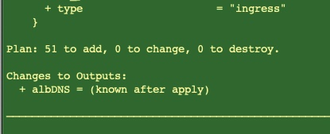

Test Machine: 2

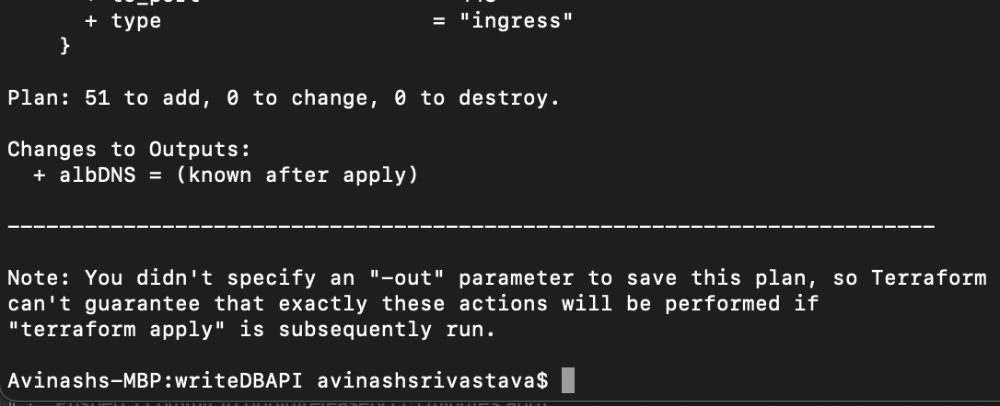

## Apply:
--> python3 deploy_from_local.py -a apply -e poc  (inside Terminal)

Test Machine: 1

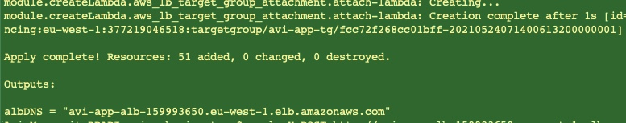

Test Machine: 2

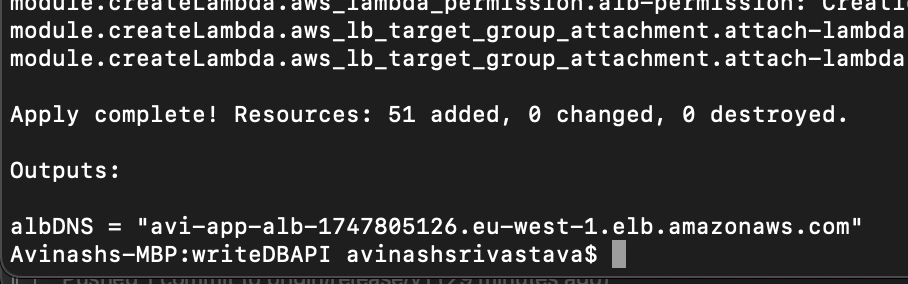

## Write data
--> curl -X POST http://"AWS ALB DNS"/app  (inside Terminal)

Test Machine: 1

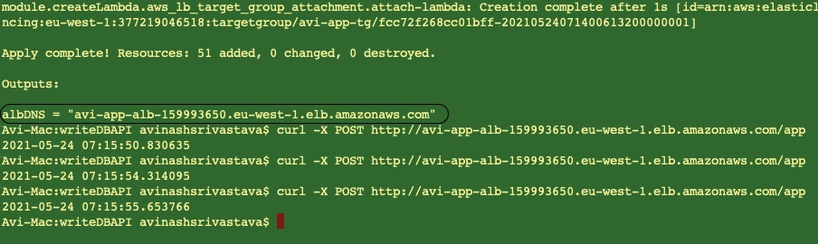

Test Machine: 2

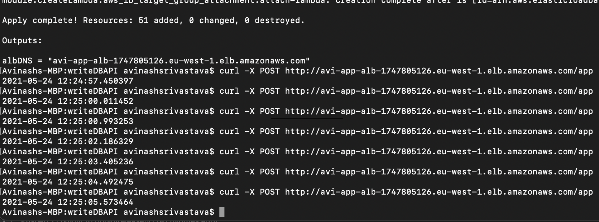

## Initialised /app endpoint
--> http://"AWS ALB DNS"/app  (inside browser)

Test Machine: 1

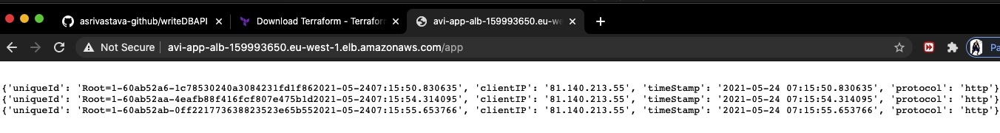

Test Machine: 2

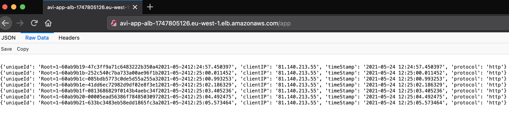

## Destroy:
--> python3 deploy_from_local.py -a destroy -e poc  (inside Terminal)

Test Machine: 1

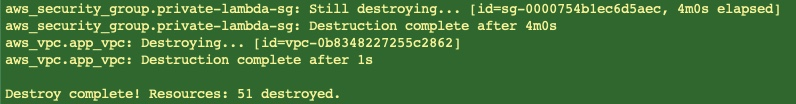

Test Machine: 2

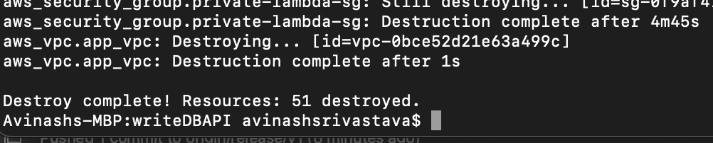

## Homepage:
--> http://"AWS ALB DNS"/  (inside browser)

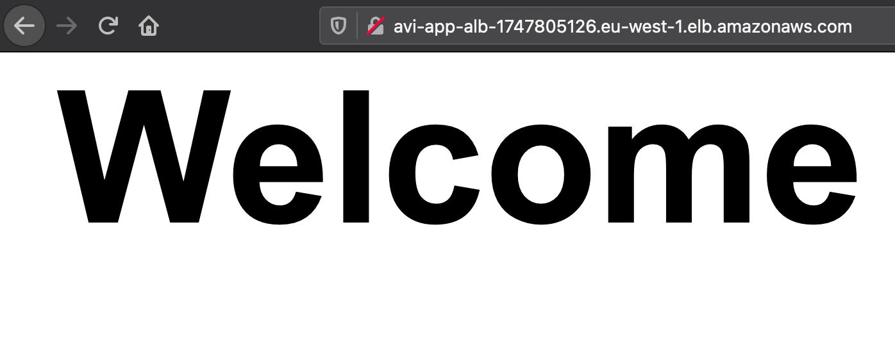

____________________________

References:

* https://docs.aws.amazon.com/vpc/latest/userguide/managed-prefix-lists.html
* https://docs.aws.amazon.com/general/latest/gr/rande.html
* https://docs.aws.amazon.com/lambda/latest/dg/configuration-vpc.html
* https://aws.amazon.com/blogs/aws/new-vpc-endpoints-for-dynamodb/
* https://docs.amazonaws.cn/en_us/amazondynamodb/latest/developerguide/vpc-endpoints-dynamodb.html
* https://docs.aws.amazon.com/amazondynamodb/latest/developerguide/vpc-endpoints-dynamodb-tutorial.html
* https://aws.amazon.com/blogs/networking-and-content-delivery/lambda-functions-as-targets-for-application-load-balancers/
* https://docs.aws.amazon.com/lambda/latest/dg/monitoring-functions-access-metrics.html
* https://docs.aws.amazon.com/lambda/latest/dg/runtimes-extensions-api.html
* https://docs.aws.amazon.com/amazondynamodb/latest/developerguide/GettingStarted.Python.03.html
* https://boto3.amazonaws.com/v1/documentation/api/latest/reference/services/dynamodb.html#service-resource
* https://docs.aws.amazon.com/general/latest/gr/aws-ip-ranges.html

___________
